# PROMETHEUS — System Architecture

> **Last updated:** 2026-03-18
> **Classification:** Internal Engineering Reference
> **Audience:** Engineers, SREs, and technical stakeholders

---

## Table of Contents

1. [High-Level System Overview](#1-high-level-system-overview)
2. [Request Lifecycle](#2-request-lifecycle)
3. [Service Interaction Map](#3-service-interaction-map)
4. [Database Schema](#4-database-schema)
5. [Real-Time Event Architecture](#5-real-time-event-architecture)
6. [Agent Execution Pipeline](#6-agent-execution-pipeline)
7. [Model Routing Decision Tree](#7-model-routing-decision-tree)
8. [Scaling Architecture (1000+ Users)](#8-scaling-architecture-1000-users)
9. [Security & Isolation Model](#9-security--isolation-model)
10. [Credit & Billing Flow](#10-credit--billing-flow)
11. [Deployment Topology](#11-deployment-topology)
12. [Memory System (5 Layers)](#12-memory-system-5-layers)
13. [Capacity Planning](#13-capacity-planning)
14. [Performance Targets & SLOs](#14-performance-targets--slos)
15. [Appendix: Key File Reference](#15-appendix-key-file-reference)

---

## 1. High-Level System Overview

Prometheus is an AI-powered engineering platform with 12 specialist agents that autonomously handle software development tasks — from requirements discovery through deployment. The platform is built as a **Turborepo monorepo** with **pnpm workspaces**, containing 9 application services and 15 shared packages.

### System Topology

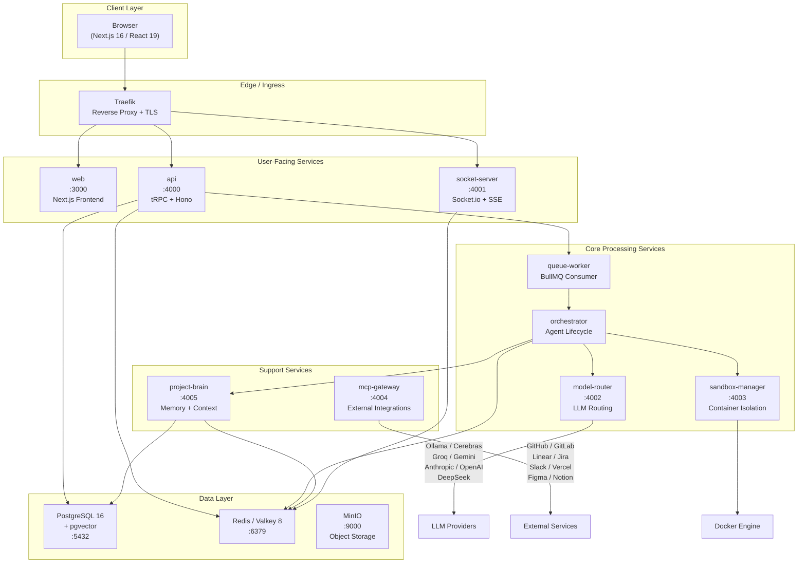

### Monorepo Structure

```
prometheus/
├── apps/                          # 9 services
│   ├── web/                       # Next.js 16 frontend (port 3000)
│   ├── api/                       # tRPC v11 + Hono backend (port 4000)
│   ├── socket-server/             # Socket.io real-time relay (port 4001)
│   ├── orchestrator/              # Agent lifecycle management
│   ├── queue-worker/              # BullMQ job consumer
│   ├── model-router/              # Multi-provider LLM routing (port 4002)
│   ├── sandbox-manager/           # Docker container isolation (port 4003)
│   ├── mcp-gateway/               # MCP external integrations (port 4004)
│   └── project-brain/             # Memory + context assembly (port 4005)
├── packages/                      # 15 shared packages
│   ├── db/                        # Drizzle ORM schemas + migrations
│   ├── ai/                        # LLM client + model registry
│   ├── agent-sdk/                 # Agent role definitions + tools
│   ├── billing/                   # Plan tiers + credit costs
│   ├── queue/                     # BullMQ queue definitions
│   ├── validators/                # Zod schemas
│   ├── logger/                    # Structured logging
│   ├── utils/                     # Shared utilities (generateId, etc.)
│   └── ...                        # Additional shared packages
├── infra/                         # Infrastructure
│   ├── docker/                    # Dockerfile.base, Dockerfile.api, Dockerfile.web
│   └── k8s/base/                  # Kubernetes manifests (HPA, KEDA, Traefik)
└── docker-compose.yml             # Local development stack
```

### Communication Protocols

| Protocol | Used Between | Purpose |
|----------|-------------|---------|
| **tRPC over HTTP** | Browser ↔ API | Type-safe RPC for all CRUD operations |
| **Socket.io (WebSocket)** | Browser ↔ Socket Server | Real-time bidirectional events |
| **SSE** | Browser ↔ API | Streaming agent session output |
| **HTTP/JSON** | API ↔ Internal services | Inter-service communication |
| **Redis Pub/Sub** | Orchestrator ↔ Socket Server | Event relay for real-time updates |
| **BullMQ (Redis)** | API → Queue Worker | Async task scheduling |
| **OpenAI-compatible HTTP** | Model Router → LLM Providers | LLM completions |
| **Docker Engine API** | Sandbox Manager → Docker | Container lifecycle |

---

## 2. Request Lifecycle

This diagram traces the complete path of a user-submitted task — from browser click through agent execution to real-time result streaming.

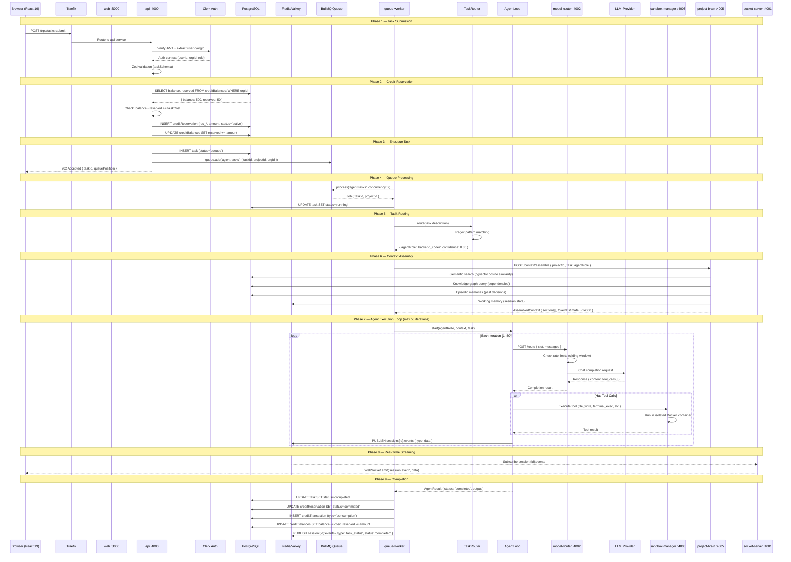

### Phase Breakdown

| Phase | Duration Target | Key Operations |
|-------|----------------|----------------|
| 1. Submission | < 100ms | Traefik routing, JWT verification, Zod validation |
| 2. Credit Reservation | < 50ms | Balance check, atomic reservation |
| 3. Enqueue | < 50ms | Task INSERT, BullMQ add |
| 4. Queue Processing | < 30s p95 | Worker picks up job |
| 5. Task Routing | < 10ms | Regex pattern matching |
| 6. Context Assembly | < 500ms | Vector search, graph query, memory recall |
| 7. Agent Loop | 30s – 10min | 1-50 LLM iterations with tool execution |
| 8. Event Streaming | < 100ms | Redis pub/sub → Socket.io relay |
| 9. Completion | < 100ms | Credit commit, status update |

---

## 3. Service Interaction Map

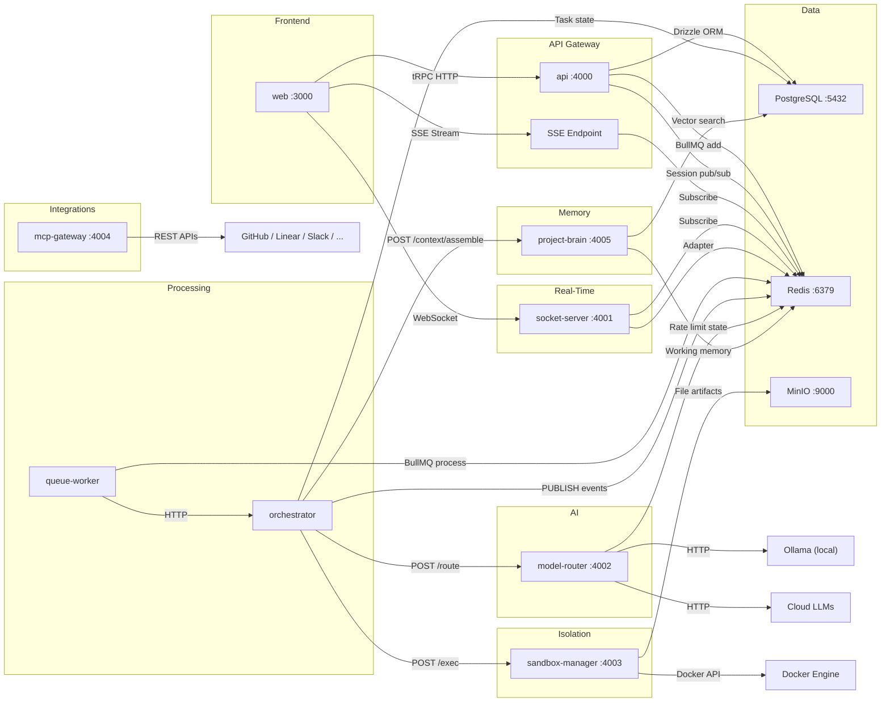

### Complete Connection Matrix

| From | To | Protocol | Port | Purpose |
|------|----|----------|------|---------|
| Browser | Traefik | HTTPS | 443 | TLS termination |
| Traefik | web | HTTP | 3000 | Next.js frontend |
| Traefik | api | HTTP | 4000 | tRPC API |
| Traefik | socket-server | WebSocket | 4001 | Real-time events |
| web | api | tRPC/HTTP | 4000 | All CRUD operations |
| web | socket-server | Socket.io | 4001 | Bidirectional events |
| web | api | SSE | 4000 | Streaming agent output |
| api | PostgreSQL | TCP | 5432 | Drizzle ORM queries |
| api | Redis | TCP | 6379 | BullMQ enqueue, pub/sub |
| queue-worker | Redis | TCP | 6379 | BullMQ consume |
| queue-worker | orchestrator | HTTP | — | Agent lifecycle |
| orchestrator | model-router | HTTP | 4002 | LLM routing |
| orchestrator | project-brain | HTTP | 4005 | Context assembly |
| orchestrator | sandbox-manager | HTTP | 4003 | Tool execution |
| orchestrator | Redis | TCP | 6379 | Event publishing |
| orchestrator | PostgreSQL | TCP | 5432 | Task/agent state |
| model-router | Ollama | HTTP | 11434 | Local LLM inference |
| model-router | Cerebras API | HTTPS | 443 | Cloud inference |
| model-router | Groq API | HTTPS | 443 | Cloud inference |
| model-router | Gemini API | HTTPS | 443 | Cloud inference |
| model-router | Anthropic API | HTTPS | 443 | Cloud inference |
| model-router | OpenAI API | HTTPS | 443 | Cloud inference |
| model-router | DeepSeek API | HTTPS | 443 | Cloud inference |
| model-router | Redis | TCP | 6379 | Rate limit state |
| project-brain | PostgreSQL | TCP | 5432 | Vector search, memories |
| project-brain | Redis | TCP | 6379 | Working memory |
| sandbox-manager | Docker | Unix socket | — | `/var/run/docker.sock` |
| sandbox-manager | MinIO | HTTP | 9000 | File artifact storage |
| mcp-gateway | External APIs | HTTPS | 443 | GitHub, Linear, Slack, etc. |
| socket-server | Redis | TCP | 6379 | Pub/sub + adapter |

---

## 4. Database Schema

PostgreSQL 16 with pgvector extension. All IDs generated via `@prometheus/utils` `generateId()`. Row-Level Security (RLS) enforced via `orgId` on all tenant-scoped tables.

### Entity Relationship Diagram

```mermaid
erDiagram
    organizations ||--o{ orgMembers : "has members"
    organizations ||--o{ projects : "owns"
    organizations ||--o{ creditBalances : "has balance"
    organizations ||--o{ creditTransactions : "has transactions"
    organizations ||--o{ creditReservations : "has reservations"
    organizations ||--o{ subscriptions : "subscribes"
    organizations ||--o{ mcpConnections : "connects"
    organizations ||--o{ apiKeys : "issues"
    organizations ||--o{ modelConfigs : "configures"
    organizations ||--o{ modelUsage : "tracks usage"
    organizations ||--o{ usageRollups : "rolls up"

    users ||--o{ orgMembers : "belongs to"
    users ||--o| userSettings : "has settings"
    users ||--o{ sessions : "starts"
    users ||--o{ apiKeys : "creates"

    projects ||--o| projectSettings : "has settings"
    projects ||--o{ projectMembers : "has members"
    projects ||--o{ sessions : "contains"
    projects ||--o{ tasks : "has tasks"
    projects ||--o{ blueprints : "defines"
    projects ||--o{ codeEmbeddings : "embeds"
    projects ||--o{ fileIndexes : "indexes"
    projects ||--o{ agentMemories : "stores"
    projects ||--o{ episodicMemories : "records"
    projects ||--o{ proceduralMemories : "learns"
    projects ||--o{ mcpToolConfigs : "configures tools"

    sessions ||--o{ sessionEvents : "emits"
    sessions ||--o{ sessionMessages : "has messages"
    sessions ||--o{ tasks : "runs"
    sessions ||--o{ agents : "spawns"

    tasks ||--o{ taskSteps : "has steps"

    blueprints ||--o{ blueprintVersions : "versioned"
    subscriptionPlans ||--o{ subscriptions : "purchased"

    organizations {
        text id PK
        text name
        text slug UK
        enum planTier "hobby|starter|pro|team|studio|enterprise"
        text stripeCustomerId UK
        timestamp createdAt
        timestamp updatedAt
    }

    orgMembers {
        text id PK
        text orgId FK
        text userId
        enum role "owner|admin|member"
        timestamp invitedAt
        timestamp joinedAt
    }

    users {
        text id PK
        text clerkId UK
        text email UK
        text name
        text avatarUrl
        timestamp createdAt
        timestamp updatedAt
    }

    userSettings {
        text userId PK_FK
        enum theme "light|dark|system"
        text defaultModel
        boolean notificationsEnabled
    }

    projects {
        text id PK
        text orgId FK
        text name
        text description
        text repoUrl
        text techStackPreset
        enum status "active|archived|setup"
        timestamp createdAt
        timestamp updatedAt
    }

    projectSettings {
        text projectId PK_FK
        enum agentAggressiveness "balanced|full_auto|supervised"
        integer ciLoopMaxIterations "default 20"
        integer parallelAgentCount "default 1"
        enum blueprintEnforcement "strict|flexible|advisory"
        integer testCoverageTarget "default 80"
        enum securityScanLevel "basic|standard|thorough"
        enum deployTarget "staging|production|manual"
        real modelCostBudget
    }

    projectMembers {
        text id PK
        text projectId FK
        text userId
        enum role "owner|contributor|viewer"
    }

    sessions {
        text id PK
        text projectId FK
        text userId FK
        enum status "active|paused|completed|failed|cancelled"
        enum mode "task|ask|plan|watch|fleet"
        timestamp startedAt
        timestamp endedAt
    }

    sessionEvents {
        text id PK
        text sessionId FK
        enum type "agent_output|file_change|plan_update|task_status|queue_position|credit_update|checkpoint|error|reasoning|terminal_output|browser_screenshot"
        jsonb data
        text agentRole
        timestamp timestamp
    }

    sessionMessages {
        text id PK
        text sessionId FK
        enum role "user|assistant|system"
        text content
        text modelUsed
        integer tokensIn
        integer tokensOut
        timestamp createdAt
    }

    tasks {
        text id PK
        text sessionId FK
        text projectId FK
        text title
        text description
        enum status "pending|queued|running|paused|completed|failed|cancelled"
        integer priority "default 50"
        text agentRole
        integer creditsReserved
        integer creditsConsumed
        timestamp startedAt
        timestamp completedAt
        timestamp createdAt
    }

    taskSteps {
        text id PK
        text taskId FK
        integer stepNumber
        text description
        enum status "pending|queued|running|paused|completed|failed|cancelled"
        text output
    }

    agents {
        text id PK
        text sessionId FK
        text role
        enum status "idle|working|error|terminated"
        text modelUsed
        integer tokensIn
        integer tokensOut
        integer stepsCompleted
        text currentTaskId
        timestamp startedAt
        timestamp lastActiveAt
        timestamp terminatedAt
    }

    codeEmbeddings {
        text id PK
        text projectId FK
        text filePath
        integer chunkIndex
        text content
        vector embedding "768 dimensions"
        timestamp updatedAt
    }

    fileIndexes {
        text id PK
        text projectId FK
        text filePath
        text fileHash
        text language
        integer loc
        timestamp lastIndexed
    }

    agentMemories {
        text id PK
        text projectId FK
        enum memoryType "semantic|episodic|procedural|architectural|convention"
        text content
        vector embedding "768 dimensions"
        timestamp createdAt
    }

    episodicMemories {
        text id PK
        text projectId FK
        text eventType
        text decision
        text reasoning
        text outcome
        timestamp createdAt
    }

    proceduralMemories {
        text id PK
        text projectId FK
        text procedureName
        jsonb steps
        timestamp lastUsed
    }

    creditBalances {
        text orgId PK_FK
        integer balance
        integer reserved
        timestamp updatedAt
    }

    creditTransactions {
        text id PK
        text orgId FK
        enum type "purchase|consumption|refund|bonus|subscription_grant"
        integer amount
        integer balanceAfter
        text taskId
        text description
        timestamp createdAt
    }

    creditReservations {
        text id PK
        text orgId FK
        text taskId
        integer amount
        enum status "active|committed|released"
        timestamp createdAt
        timestamp expiresAt
    }

    modelUsage {
        text id PK
        text orgId FK
        text sessionId
        text taskId
        text provider
        text model
        integer tokensIn
        integer tokensOut
        real costUsd
        timestamp createdAt
    }

    modelConfigs {
        text id PK
        text orgId FK
        text provider
        text modelId
        text apiKeyEncrypted
        boolean isDefault
        integer priority
    }

    blueprints {
        text id PK
        text projectId FK
        text version
        text content
        jsonb techStack
        boolean isActive
        timestamp createdAt
    }

    blueprintVersions {
        text id PK
        text blueprintId FK
        text version
        text diff
        text changedBy
        timestamp createdAt
    }

    techStackPresets {
        text id PK
        text name
        text slug UK
        text description
        jsonb configJson
        text icon
    }

    subscriptionPlans {
        text id PK
        text name
        text stripePriceId
        integer creditsIncluded
        integer maxParallelAgents
        jsonb featuresJson
    }

    subscriptions {
        text id PK
        text orgId FK
        text planId FK
        text stripeSubscriptionId UK
        enum status "active|past_due|cancelled|trialing|incomplete"
        timestamp currentPeriodStart
        timestamp currentPeriodEnd
    }

    mcpConnections {
        text id PK
        text orgId FK
        text provider
        text credentialsEncrypted
        enum status "connected|disconnected|error"
        timestamp connectedAt
    }

    mcpToolConfigs {
        text id PK
        text projectId FK
        text toolName
        boolean enabled
        jsonb configJson
    }

    apiKeys {
        text id PK
        text orgId FK
        text userId FK
        text keyHash UK
        text name
        timestamp lastUsed
        timestamp createdAt
        timestamp revokedAt
    }

    usageRollups {
        text id PK
        text orgId FK
        timestamp periodStart
        timestamp periodEnd
        integer tasksCompleted
        integer creditsUsed
        real costUsd
    }
```

### Table Groups

| Group | Tables | Purpose |
|-------|--------|---------|
| **Core** | organizations, orgMembers, users, userSettings | Identity, multi-tenancy |
| **Projects** | projects, projectSettings, projectMembers | Project configuration |
| **Sessions** | sessions, sessionEvents, sessionMessages | User interaction tracking |
| **Tasks** | tasks, taskSteps, agents | Agent work tracking |
| **Memory / AI** | codeEmbeddings, fileIndexes, agentMemories, episodicMemories, proceduralMemories | AI memory system |
| **Billing** | creditBalances, creditTransactions, creditReservations, subscriptionPlans, subscriptions | Monetization |
| **Models** | modelUsage, modelConfigs | LLM tracking and configuration |
| **Integrations** | mcpConnections, mcpToolConfigs, apiKeys | External service connections |
| **Blueprints** | blueprints, blueprintVersions, techStackPresets | Architecture definitions |
| **Analytics** | usageRollups | Aggregated usage metrics |

### Key Indexes

| Table | Index | Columns | Purpose |
|-------|-------|---------|---------|
| codeEmbeddings | code_embeddings_project_file_idx | (projectId, filePath) | Fast file lookup |
| fileIndexes | file_indexes_project_path_idx | (projectId, filePath) | Dedup file indexing |
| codeEmbeddings | — (pgvector) | embedding | Cosine similarity search |
| agentMemories | — (pgvector) | embedding | Memory vector search |

### Multi-Tenancy (RLS)

Every tenant-scoped table includes an `orgId` column. All queries are scoped by organization:

```
WHERE orgId = :currentOrgId
```

This applies to: projects, sessions, tasks, credits, subscriptions, model configs, MCP connections, API keys, usage rollups, and all memory tables (scoped via projectId → project.orgId).

---

## 5. Real-Time Event Architecture

The platform supports three real-time delivery mechanisms:

1. **Socket.io WebSocket** — bidirectional, room-based
2. **SSE (Server-Sent Events)** — unidirectional streaming from API
3. **Redis Pub/Sub** — internal event bus between services

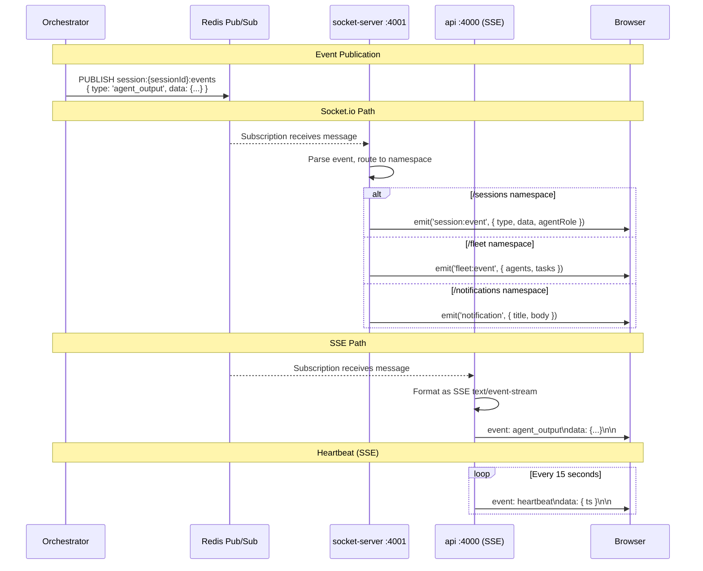

### Socket.io Namespaces

| Namespace | Room Pattern | Events Emitted | Events Received |
|-----------|-------------|----------------|-----------------|
| `/sessions` | `session:{sessionId}` | `session:event`, `session:error` | `join`, `leave`, `message`, `command`, `takeover`, `release`, `approve-plan`, `checkpoint-response`, `pause`, `resume` |
| `/fleet` | `fleet:{orgId}` | `fleet:event`, `fleet:status` | `fleet:status`, `fleet:stop-agent`, `fleet:reassign` |
| `/notifications` | `user:{userId}` | `notification` | `mark-read` |

### Session Event Types

| Event Type | Source | Payload |
|------------|--------|---------|
| `agent_output` | AgentLoop | `{ content, agentRole, iteration }` |
| `file_change` | AgentLoop | `{ filePath, operation, diff }` |
| `plan_update` | AgentLoop | `{ steps[], currentStep }` |
| `task_status` | QueueWorker | `{ taskId, status, agentRole }` |
| `queue_position` | API | `{ position, estimatedWait }` |
| `credit_update` | QueueWorker | `{ consumed, remaining }` |
| `checkpoint` | AgentLoop | `{ question, options[], context }` |
| `error` | AgentLoop | `{ message, code, recoverable }` |
| `reasoning` | AgentLoop | `{ thought, agentRole }` |
| `terminal_output` | SandboxManager | `{ stdout, stderr, exitCode }` |
| `browser_screenshot` | SandboxManager | `{ url, imageBase64 }` |

### Redis Channel Pattern

```
session:{sessionId}:events    — per-session agent events
fleet:{orgId}:events          — org-wide fleet events
notifications:{userId}        — per-user notifications
```

### SSE Configuration

The SSE endpoint (`apps/api/src/routes/sse.ts`) uses:
- `Content-Type: text/event-stream`
- `Cache-Control: no-cache`
- `Connection: keep-alive`
- 15-second heartbeat interval
- Traefik middleware for SSE headers (disables buffering)

---

## 6. Agent Execution Pipeline

### Agent Roles

Prometheus ships with 12 specialist agents, each with a preferred model and specific tool access:

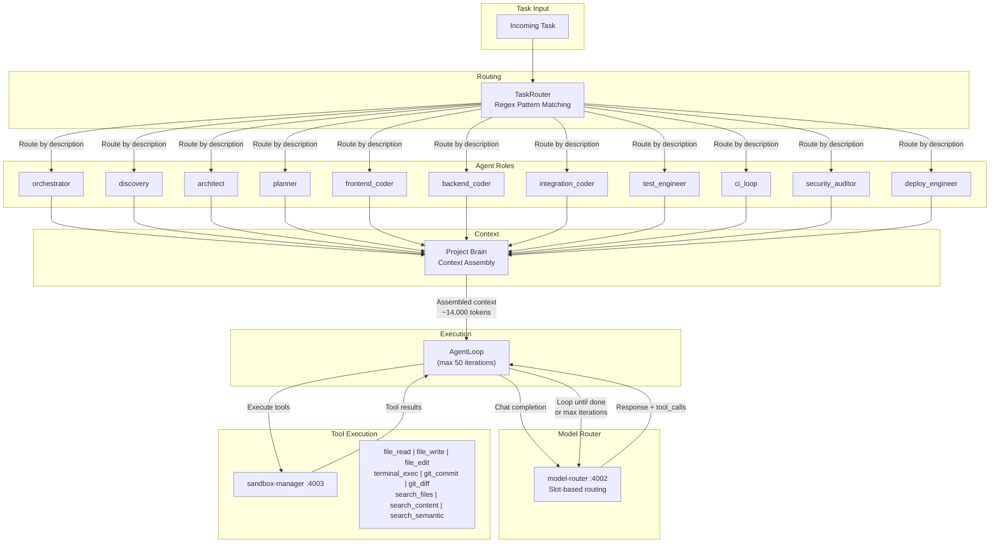

### Agent Role Configuration

| # | Role | Preferred Model | Slot | Tools | Description |
|---|------|----------------|------|-------|-------------|
| 1 | `orchestrator` | ollama/qwen3.5:27b | think | — (coordination only) | Coordinates all agents, resolves conflicts, tracks velocity |
| 2 | `discovery` | gemini/gemini-2.5-flash | longContext | search_semantic, file_read, search_content | Requirements elicitation via 5-question framework (WHO, WHAT, NOT, DONE, RISK) |
| 3 | `architect` | ollama/deepseek-r1:32b | think | file_read, file_write, search_files, search_content | Designs architecture, creates Blueprint.md, defines tech stack + DB schema |
| 4 | `planner` | ollama/qwen3.5:27b | think | file_read, search_semantic | Creates sprint plans with task decomposition and dependency mapping |
| 5 | `frontend_coder` | ollama/qwen3-coder-next | default | file_read, file_write, file_edit, terminal_exec, git_commit, git_diff, search_files, search_content | Implements React/Next.js components, pages, styling |
| 6 | `backend_coder` | ollama/qwen3-coder-next | default | file_read, file_write, file_edit, terminal_exec, git_commit, git_diff, search_files, search_content | Implements APIs, services, business logic, DB queries |
| 7 | `integration_coder` | cerebras/qwen3-235b | fastLoop | file_read, file_write, file_edit, terminal_exec, search_files, search_content | Wires frontend ↔ backend, tRPC + Socket.io integration |
| 8 | `test_engineer` | groq/llama-3.3-70b | default | file_read, file_write, file_list, terminal_exec, search_files, search_content | Writes unit, integration, and E2E tests |
| 9 | `ci_loop` | cerebras/qwen3-235b | fastLoop | terminal_exec, file_read, search_content | Test-fail-analyze-fix cycle (max 20 iterations via `ciLoopMaxIterations`) |
| 10 | `security_auditor` | ollama/deepseek-r1:32b | think | file_read, search_files, search_content, terminal_exec | OWASP vulnerability scanning, security review |
| 11 | `deploy_engineer` | ollama/qwen3-coder-next | default | file_read, file_write, file_edit, terminal_exec, search_files | Docker, k8s, CI/CD pipeline configuration |

### Task Routing Rules

The `TaskRouter` uses regex pattern matching against the task description to select the appropriate agent role:

| Pattern Category | Example Regex Matches | Routes To | Confidence |
|------------------|-----------------------|-----------|------------|
| Discovery | `requirements`, `scope`, `user stories`, `clarify` | discovery | 0.80–0.95 |
| Architecture | `architecture`, `blueprint`, `schema design`, `tech stack` | architect | 0.80–0.95 |
| Planning | `plan`, `sprint`, `breakdown`, `estimate` | planner | 0.80–0.95 |
| Frontend | `react`, `component`, `page`, `css`, `tailwind`, `ui` | frontend_coder | 0.80–0.95 |
| Backend | `api`, `endpoint`, `database`, `query`, `service`, `trpc` | backend_coder | 0.80–0.95 |
| Integration | `connect`, `wire`, `integrate`, `socket`, `websocket` | integration_coder | 0.80–0.95 |
| Testing | `test`, `spec`, `coverage`, `e2e`, `unit test` | test_engineer | 0.80–0.95 |
| Security | `security`, `vulnerability`, `owasp`, `audit`, `xss` | security_auditor | 0.80–0.95 |
| Deployment | `deploy`, `docker`, `kubernetes`, `ci/cd`, `pipeline` | deploy_engineer | 0.80–0.95 |
| **Fallback** | *(no match)* | orchestrator | 0.50 |

### AgentLoop Execution Details

The `AgentLoop` class (`apps/orchestrator/src/agent-loop.ts`) manages the full lifecycle of a single agent execution:

1. **Initialization** — Load context from Project Brain, set up system prompt with role instructions
2. **LLM Loop** — Send messages to Model Router, process completions
3. **Tool Execution** — Execute tool calls in sandbox, collect results
4. **Event Publishing** — Publish all events to Redis for real-time streaming
5. **Credit Tracking** — 1 credit per 1,000 tokens consumed
6. **Blocker Detection** — 3 consecutive failures triggers "human input needed" checkpoint
7. **Termination** — Max 50 iterations, or task complete, or explicit stop

### Slot-to-Role Mapping

Different agent roles are routed to different Model Router slots based on their workload characteristics:

| Slot | Used By | Primary Model | Why |
|------|---------|---------------|-----|
| `think` | orchestrator, architect, planner, security_auditor | ollama/deepseek-r1:32b | Reasoning-heavy tasks |
| `default` | frontend_coder, backend_coder, test_engineer, deploy_engineer | ollama/qwen3-coder-next | Code generation |
| `fastLoop` | integration_coder, ci_loop | cerebras/qwen3-235b | Rapid iteration |
| `longContext` | discovery | gemini/gemini-2.5-flash | Large context windows |

---

## 7. Model Routing Decision Tree

The Model Router (`apps/model-router/`) provides intelligent routing across 15 models from 7 providers, with automatic fallback chains and Redis-backed rate limiting.

### Slot-Based Routing

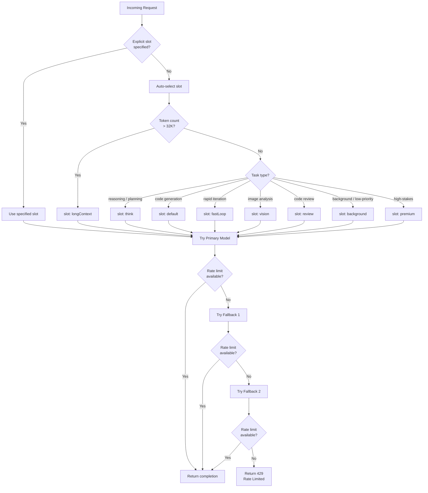

### Slot Configuration

| Slot | Primary Model | Fallback 1 | Fallback 2 | Use Case |
|------|--------------|------------|------------|----------|
| `default` | ollama/qwen3-coder-next | cerebras/qwen3-235b | groq/llama-3.3-70b | General code generation |
| `think` | ollama/deepseek-r1:32b | ollama/qwen3.5:27b | anthropic/claude-sonnet-4-6 | Reasoning, architecture |
| `longContext` | gemini/gemini-2.5-flash | anthropic/claude-sonnet-4-6 | ollama/qwen3-coder-next | Large file analysis |
| `background` | ollama/qwen2.5-coder:7b | ollama/qwen2.5-coder:14b | ollama/qwen3-coder-next | Low-priority tasks |
| `vision` | anthropic/claude-sonnet-4-6 | gemini/gemini-2.5-flash | — | Image/screenshot analysis |
| `review` | anthropic/claude-sonnet-4-6 | ollama/deepseek-r1:32b | ollama/qwen3.5:27b | Code review, audits |
| `fastLoop` | cerebras/qwen3-235b | groq/llama-3.3-70b | ollama/qwen3-coder-next | CI loops, quick iteration |
| `premium` | anthropic/claude-opus-4-6 | anthropic/claude-sonnet-4-6 | ollama/deepseek-r1:32b | Critical decisions |

### Model Registry (5 Tiers)

| Tier | Provider | Model | Context Window | Cost (Input/Output per 1M tokens) | RPM Limit | TPM Limit |
|------|----------|-------|---------------|-----------------------------------|-----------|-----------|
| **0 — Free (Local)** | Ollama | qwen3-coder-next | 32K | $0 / $0 | ∞ | ∞ |
| 0 | Ollama | deepseek-r1:32b | 32K | $0 / $0 | ∞ | ∞ |
| 0 | Ollama | qwen3.5:27b | 32K | $0 / $0 | ∞ | ∞ |
| 0 | Ollama | qwen2.5-coder:14b | 32K | $0 / $0 | ∞ | ∞ |
| 0 | Ollama | nomic-embed-text | 8K | $0 / $0 | ∞ | ∞ |
| **1 — Free APIs** | Cerebras | qwen3-235b | 8K | $0 / $0 | 30 | 1,000,000 |
| 1 | Groq | llama-3.3-70b | 131K | $0 / $0 | 30 | 131,000 |
| 1 | Gemini | gemini-2.5-flash | 1M | $0 / $0 | 15 | 4,000,000 |
| **2 — Low-cost** | DeepSeek | deepseek-coder | 128K | $0.14 / $0.28 | 60 | ∞ |
| **3 — Mid-tier** | Anthropic | claude-sonnet-4-6 | 200K | $3.00 / $15.00 | 50 | 80,000 |
| **4 — Premium** | Anthropic | claude-opus-4-6 | 200K | $15.00 / $75.00 | 20 | 80,000 |

### Fallback Chain Diagram

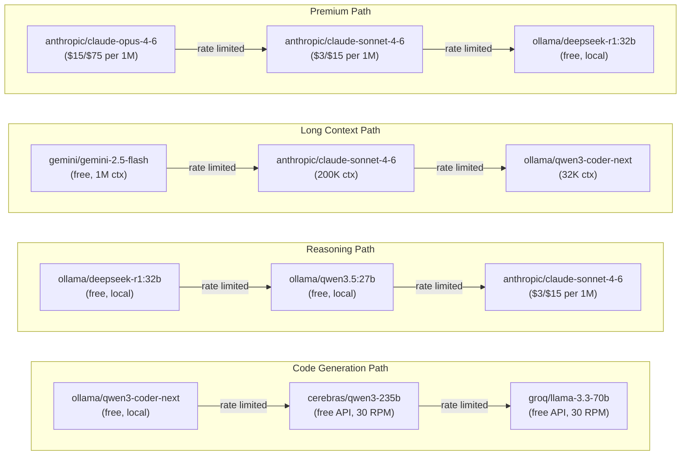

### Rate Limiting

The Rate Limiter (`apps/model-router/src/rate-limiter.ts`) uses **Redis sliding windows** per provider:

| Provider | RPM Limit | TPM Limit | Window |
|----------|-----------|-----------|--------|
| Ollama | Unlimited | Unlimited | — |
| Cerebras | 30 | 1,000,000 | 60s |
| Groq | 30 | 131,000 | 60s |
| Gemini | 15 | 4,000,000 | 60s |
| OpenRouter | 20 | 200,000 | 60s |
| Mistral | 2 | Unlimited | 60s |
| DeepSeek | 60 | Unlimited | 60s |
| Anthropic | 50 | 80,000 | 60s |
| OpenAI | 60 | Unlimited | 60s |

### Model Router API Endpoints

| Method | Path | Purpose |
|--------|------|---------|
| `POST` | `/route` | Primary slot-based routing |
| `POST` | `/v1/chat/completions` | OpenAI-compatible legacy endpoint |
| `GET` | `/v1/models` | List all available models |
| `GET` | `/v1/slots` | List slot configurations |
| `GET` | `/v1/rate-limits` | Current rate limit status |
| `POST` | `/v1/estimate-tokens` | Token estimation + slot recommendation |
| `GET` | `/health` | Health check |

---

## 8. Scaling Architecture (1000+ Users)

### Cluster Topology

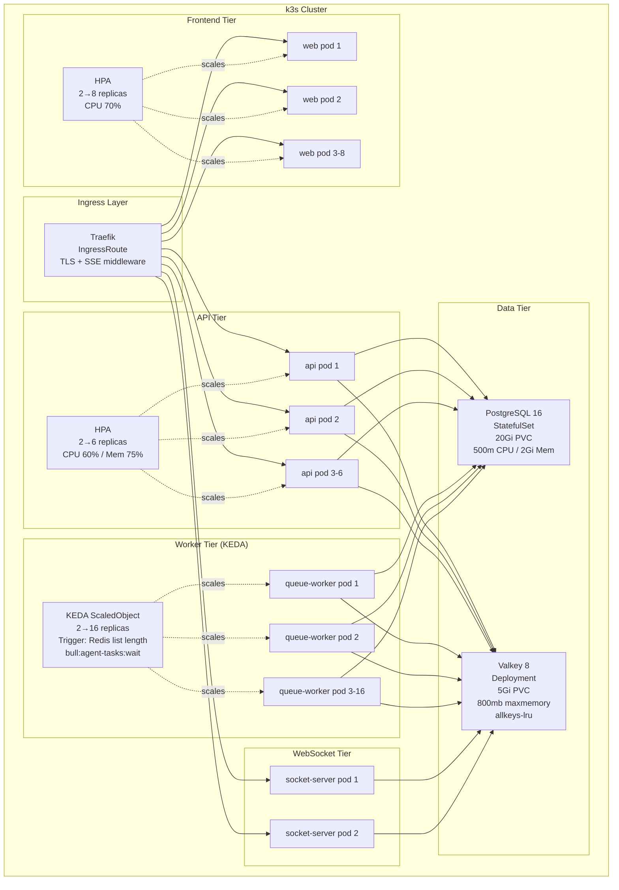

### Autoscaling Configuration

| Service | Scaler | Min | Max | Triggers | Stabilization |
|---------|--------|-----|-----|----------|---------------|
| **web** | HPA | 2 | 8 | CPU avg 70% | Scale-down: 300s |
| **api** | HPA | 2 | 6 | CPU avg 60%, Memory avg 75% | Scale-down: 300s |
| **queue-worker** | KEDA | 2 | 16 | Redis list `bull:agent-tasks:wait` length | Scale-down: 60s |
| **socket-server** | Manual | 2 | 2 | — | — |

### Resource Allocations (per pod)

| Service | CPU Request | CPU Limit | Memory Request | Memory Limit |
|---------|------------|-----------|---------------|-------------|
| **web** | 250m | 500m | 512Mi | 1Gi |
| **api** | 250m | 500m | 512Mi | 1Gi |
| **socket-server** | 250m | 500m | 512Mi | 1Gi |
| **queue-worker** | 500m | 1000m | 1.5Gi | 3Gi |
| **PostgreSQL** | 500m | 2000m | 2Gi | 4Gi |
| **Redis/Valkey** | — | — | — | 800mb (maxmemory) |

### Capacity Math for 1000+ MAU

```
Assumptions:
  - 1,000 Monthly Active Users (MAU)
  - 20% Daily Active User rate → 200 DAU
  - Peak concurrency: 25% of DAU → 50 concurrent users
  - 3 tasks/day per active user → 600 tasks/day
  - Average task duration: 2-5 minutes

Queue Worker Capacity:
  - Each pod: concurrency 2 (parallel tasks per worker)
  - Base: 2 pods × 2 = 4 concurrent tasks
  - Peak: 16 pods × 2 = 32 concurrent tasks
  - Throughput: 32 tasks × ~3 min avg = ~640 tasks/hour peak
  - Daily capacity at peak: easily handles 600 tasks/day

Sandbox Capacity:
  - Warm pool: 5 pre-created containers per sandbox-manager
  - Max containers: 16 per sandbox-manager instance
  - Warm start: <200ms, Cold start: <5s

API Capacity:
  - 2 pods baseline → handles ~200 concurrent connections
  - 6 pods at peak → handles ~600 concurrent connections
  - tRPC batching reduces actual request count

WebSocket Capacity:
  - 2 pods with Redis adapter for sticky sessions
  - Each pod: ~5,000 concurrent WebSocket connections
  - Total: ~10,000 concurrent connections (well above 50 concurrent users)

Database Capacity:
  - Connection pool: 20 connections per API pod
  - Peak: 6 pods × 20 = 120 connections
  - PostgreSQL default max: 100 (needs tuning for peak)
```

### KEDA Scaling Behavior

The KEDA `ScaledObject` monitors the Redis list length for the BullMQ `agent-tasks` queue:

```yaml
triggers:
  - type: redis
    metadata:
      address: redis:6379
      listName: bull:agent-tasks:wait
      listLength: "2"        # Scale up when >2 waiting jobs
```

When the wait queue exceeds 2 jobs, KEDA scales queue-worker pods from 2 up to 16. Scale-down occurs after the queue empties (cooldown: 60s).

---

## 9. Security & Isolation Model

### Three-Layer Security Architecture

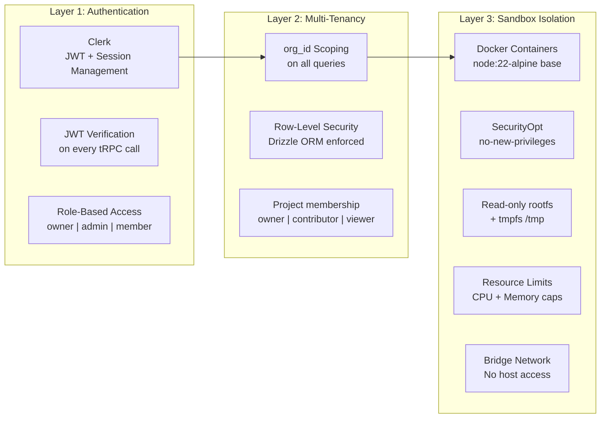

### Authentication (Clerk)

| Check | Applied At | Details |
|-------|-----------|---------|
| JWT verification | API middleware | Every tRPC request verified via Clerk |
| User identity | tRPC context | `userId` and `orgId` injected into context |
| Organization membership | Query layer | All queries scoped to authenticated org |
| Role authorization | Router level | owner/admin/member permissions per endpoint |
| API key auth | API middleware | SHA-256 hashed keys in `apiKeys` table, `keyHash` unique index |

### Multi-Tenancy Isolation

All tenant-scoped database queries include `WHERE orgId = :currentOrgId`. This is enforced at the Drizzle ORM query layer — not database-level RLS — ensuring no cross-tenant data leakage.

Scoping chain:
```
Organization → Projects → Sessions → Tasks → Agent Events
                       → Blueprints → Memories → Embeddings
```

### Sandbox Security Controls

The `ContainerManager` (`apps/sandbox-manager/src/container.ts`) creates isolated Docker containers for agent tool execution:

| Control | Setting | Purpose |
|---------|---------|---------|
| **Base image** | `node:22-alpine` | Minimal attack surface |
| **Security options** | `no-new-privileges` | Prevent privilege escalation |
| **Filesystem** | Read-only root + tmpfs | Prevent persistent modifications |
| **tmpfs mount** | `/tmp` with noexec | Temp storage without execution |
| **CPU limit** | Configurable nanoseconds | Prevent CPU abuse |
| **Memory limit** | Configurable bytes | Prevent memory abuse |
| **Network** | Bridge mode | Isolated network namespace |
| **Docker socket** | Host-mounted read-only | For container management only |

### Credential Security

| Asset | Protection |
|-------|-----------|
| API keys (user) | SHA-256 hashed (`keyHash`), only hash stored |
| MCP credentials | AES-encrypted (`credentialsEncrypted` column) |
| Model API keys | AES-encrypted (`apiKeyEncrypted` column) |
| Stripe keys | Environment variables only, never in DB |
| Clerk secrets | Environment variables only |

---

## 10. Credit & Billing Flow

### Reserve → Execute → Commit Pattern

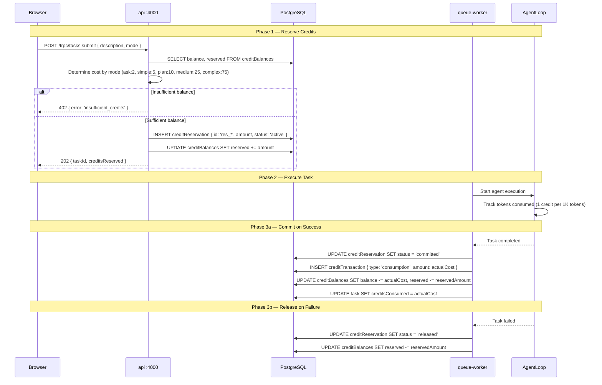

### Plan Tiers

| Tier | Price | Credits/Month | Max Parallel Agents | Max Tasks/Day | Key Features |
|------|-------|--------------|--------------------|--------------|--------------|
| **Hobby** | $0 | 50 | 1 | 10 | Community support |
| **Starter** | $19/mo | 500 | 2 | 50 | Email support |
| **Pro** | $49/mo | 2,000 | 4 | 200 | Priority support, API access |
| **Team** | $99/mo | 5,000 | 8 | 500 | Team management, analytics |
| **Studio** | $249/mo | 15,000 | 16 | 1,000 | Custom blueprints, SSO |
| **Enterprise** | Custom | Unlimited | Unlimited | Unlimited | SLA, dedicated support |

### Credit Costs by Task Type

| Task Mode | Credits | Typical Use |
|-----------|---------|-------------|
| `ask_mode` | 2 | Quick questions, explanations |
| `simple_fix` | 5 | Bug fixes, small changes |
| `plan_mode` | 10 | Architecture planning, sprint breakdown |
| `medium_task` | 25 | Feature implementation, refactoring |
| `complex_task` | 75 | Multi-file features, full-stack implementation |

### BullMQ Queues

| Queue | Purpose | Concurrency | Retry Strategy | Cleanup |
|-------|---------|-------------|----------------|---------|
| `agent-tasks` | Primary agent execution | 2 per worker | 3 retries, exponential backoff | Completed: 1h, Failed: 24h |
| `indexing` | Code indexing and embedding | — | 3 retries, exponential backoff | Completed: 1h, Failed: 24h |
| `notifications` | User notifications | — | 3 retries, exponential backoff | Completed: 1h, Failed: 24h |
| `billing-events` | Credit transactions, Stripe webhooks | — | 3 retries, exponential backoff | Completed: 1h, Failed: 24h |

---

## 11. Deployment Topology

### Development vs Production

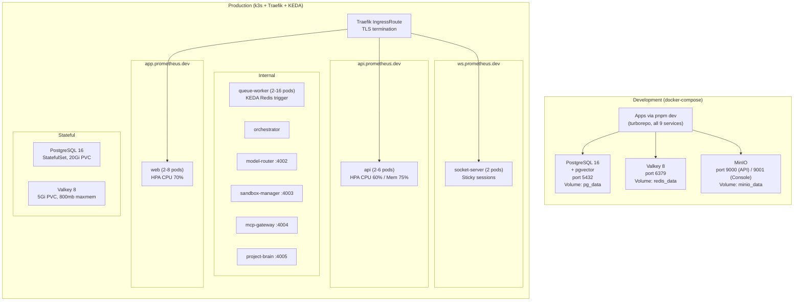

### Traefik Ingress Routes

| Host | Service | Port | Middleware |
|------|---------|------|-----------|
| `app.prometheus.dev` | web | 3000 | — |
| `api.prometheus.dev` | api | 4000 | SSE headers (disable buffering) |
| `ws.prometheus.dev` | socket-server | 4001 | — |

All routes use TLS via the `prometheus-tls` certificate resolver.

### SSE Headers Middleware

Traefik applies custom headers for SSE endpoints to prevent response buffering:

```yaml
apiVersion: traefik.io/v1alpha1
kind: Middleware
metadata:
  name: sse-headers
spec:
  headers:
    customResponseHeaders:
      X-Accel-Buffering: "no"
      Cache-Control: "no-cache"
```

### Docker Multi-Stage Builds

| Dockerfile | Base | Stages | Output |
|-----------|------|--------|--------|
| `Dockerfile.base` | node:22-alpine | 1 stage | Base image with pnpm 10 |
| `Dockerfile.api` | Dockerfile.base | 3 stages (deps → builder → runner) | API service image |
| `Dockerfile.web` | Dockerfile.base | 3 stages (deps → builder → runner) | Next.js standalone output |

Build flow:
```
Dockerfile.base → node:22-alpine + pnpm 10
                ↓
Dockerfile.api  → install deps → build → copy dist (minimal runtime)
Dockerfile.web  → install deps → next build → copy .next/standalone
```

### Monitoring & Alerts

The platform includes 10 PrometheusRule alert definitions (`infra/k8s/base/monitoring/alert-rules.yaml`):

| Alert | Condition | Severity |
|-------|-----------|----------|
| HighMemoryUsage | Container memory > 90% for 5m | warning |
| HighCPUUsage | Container CPU > 85% for 10m | warning |
| QueueDepthCritical | `agent-tasks:wait` > 50 for 5m | critical |
| PodOOMKilled | OOMKilled restart detected | critical |
| PostgresReplicationLag | Replication lag > 30s for 5m | warning |
| CertificateExpiringSoon | TLS cert expires < 7 days | warning |
| DiskUsageHigh | Disk usage > 85% | warning |
| APIErrorRateHigh | 5xx rate > 5% for 5m | critical |
| AgentFailureRateHigh | Agent failure rate > 20% for 15m | warning |
| CreditLedgerImbalance | Sum(transactions) ≠ balance | critical |

---

## 12. Memory System (5 Layers)

The Project Brain service (`apps/project-brain/`) implements a 5-layer memory architecture that gives agents persistent, contextual understanding of codebases.

### Memory Architecture

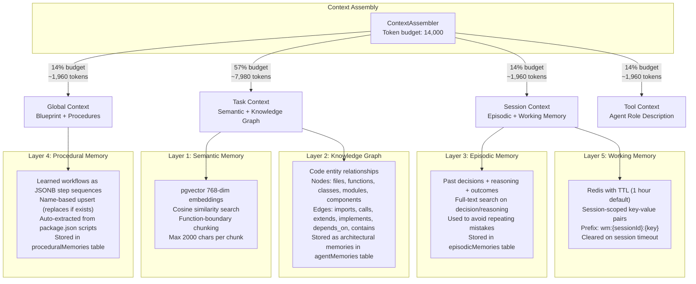

### Layer Details

#### Layer 1: Semantic Memory

Stores code understanding via vector embeddings for similarity search.

| Property | Value |
|----------|-------|
| **Storage** | `codeEmbeddings` table (PostgreSQL + pgvector) |
| **Embedding dimensions** | 768 |
| **Similarity metric** | Cosine similarity |
| **Chunking strategy** | Function/class boundary detection |
| **Max chunk size** | 2,000 characters |
| **Fallback** | ILIKE text search if vector search fails |
| **Language support** | 18+ languages (TS, JS, Python, Go, Rust, Java, C/C++, etc.) |
| **Max file size** | 256KB |

Indexing flow:
1. File watcher detects change → hash comparison with `fileIndexes`
2. If changed, chunk by declarations (functions, classes, exports)
3. Generate embeddings (pseudo-hash currently, real model TODO)
4. Upsert into `codeEmbeddings` with project + file path

#### Layer 2: Knowledge Graph

Tracks architectural relationships between code entities.

| Node Types | Edge Types |
|------------|------------|
| files | imports |
| functions | calls |
| classes | extends |
| modules | implements |
| components | depends_on |
| | contains |

The knowledge graph is stored in the `agentMemories` table with `memoryType = 'architectural'` and content as JSON describing nodes and edges.

Auto-analysis on file indexing:
- Extract import statements → create `imports` edges
- Detect class inheritance → create `extends` edges
- Find function exports → create `contains` edges

#### Layer 3: Episodic Memory

Records agent decisions, reasoning, and outcomes for learning from experience.

| Field | Purpose |
|-------|---------|
| `eventType` | Category of the event (e.g., "architecture_decision", "bug_fix") |
| `decision` | What was decided |
| `reasoning` | Why it was decided |
| `outcome` | What happened (success/failure + details) |

Search: Full-text search on `decision` and `reasoning` fields using ILIKE.

#### Layer 4: Procedural Memory

Stores reusable workflows as step sequences.

```json
{
  "procedureName": "run-tests",
  "steps": [
    { "action": "terminal_exec", "command": "pnpm test" },
    { "action": "parse_output", "pattern": "FAIL|PASS" },
    { "action": "file_read", "path": "coverage/summary.json" }
  ]
}
```

Auto-extraction: Parses `package.json` scripts into procedures (e.g., `pnpm dev`, `pnpm build`, `pnpm test`).

#### Layer 5: Working Memory

Ephemeral, session-scoped storage in Redis.

| Property | Value |
|----------|-------|
| **Storage** | Redis key-value |
| **Key pattern** | `wm:{sessionId}:{key}` |
| **Default TTL** | 1 hour |
| **Scope** | Single session |
| **Operations** | set, get, getAll, delete, clearSession |

Used for: current file being edited, conversation state, intermediate results, agent scratchpad.

### Context Assembly Budget

The `ContextAssembler` (`apps/project-brain/src/context/assembler.ts`) allocates the 14,000 token default budget:

| Section | Budget % | ~Tokens | Sources |
|---------|----------|---------|---------|
| **Global** | 14% | 1,960 | Active blueprint + all project procedures |
| **Task-specific** | 57% | 7,980 | Top-5 semantic search results + knowledge graph dependencies |
| **Session** | 14% | 1,960 | Recent episodic memories + working memory |
| **Tools** | 14% | 1,960 | Agent role description and tool documentation |

Token estimation: ~4 characters per token.

### Session Resume

When resuming a paused session, the `SessionResume` service generates a briefing:

1. Load last 20 session events
2. Extract recent actions (file changes, agent output, task status)
3. Identify current state (active task, open files, agent status)
4. Surface pending decisions and unresolved errors
5. Return `SessionBriefing { summary, actions[], state, nextSteps[] }`

### Project Brain API

| Method | Path | Purpose |
|--------|------|---------|
| `POST` | `/context/assemble` | Assemble agent context with token budget |
| `POST` | `/sessions/:id/resume` | Generate session resume briefing |
| `POST` | `/index/file` | Index a file (chunk + embed) |
| `POST` | `/search/semantic` | Vector similarity search |
| `POST` | `/memory/store` | Store episodic/procedural memory |
| `POST` | `/graph/query` | Query knowledge graph |
| `POST` | `/working-memory/set` | Set working memory value |
| `GET` | `/working-memory/:sessionId/:key` | Get working memory value |

---

## 13. Capacity Planning

### Compute Requirements (1000 MAU)

| Service | Pods | CPU (total) | Memory (total) | Notes |
|---------|------|-------------|---------------|-------|
| web | 2-8 | 0.5-4 cores | 1-8 Gi | HPA scales on CPU |
| api | 2-6 | 0.5-3 cores | 1-6 Gi | HPA scales on CPU + memory |
| socket-server | 2 | 0.5 cores | 1 Gi | Redis adapter for scaling |
| queue-worker | 2-16 | 1-16 cores | 3-48 Gi | KEDA scales on queue depth |
| orchestrator | 1-2 | 0.25-0.5 cores | 512Mi-1 Gi | Stateless coordinator |
| model-router | 1-2 | 0.25-0.5 cores | 256Mi-512Mi | Lightweight HTTP router |
| sandbox-manager | 1-2 | 0.5-1 cores | 1-2 Gi | Docker container management |
| mcp-gateway | 1 | 0.25 cores | 256Mi | External API proxy |
| project-brain | 1-2 | 0.5-1 cores | 1-2 Gi | Vector search + memory |
| **PostgreSQL** | 1 | 0.5-2 cores | 2-4 Gi | StatefulSet, 20Gi PVC |
| **Redis/Valkey** | 1 | — | 800 Mb max | 5Gi PVC, allkeys-lru |
| **Total baseline** | **~15 pods** | **~5 cores** | **~12 Gi** | |
| **Total peak** | **~40+ pods** | **~28 cores** | **~75 Gi** | |

### Database Sizing

| Metric | Estimate | Notes |
|--------|----------|-------|
| **Base schema** | ~5 MB | 30+ tables, indexes |
| **Per-org data** | ~1-5 MB/month | Sessions, tasks, events, messages |
| **Embeddings** | ~50-100 MB/project | 768-dim vectors, depends on codebase size |
| **Monthly growth** | ~100 MB | At 1000 MAU with average activity |
| **Year 1 total** | ~1.5-3 GB | Well within 20Gi PVC |
| **Recommended PVC** | 20 Gi | Room for 5+ years of growth |

### Redis Sizing

| Usage | Estimate | Notes |
|-------|----------|-------|
| **BullMQ queues** | ~50-100 MB | 4 queues, job retention 1-24h |
| **Socket.io adapter** | ~10-50 MB | Room state, session mappings |
| **Pub/sub channels** | ~10 MB | Transient message buffers |
| **Rate limit state** | ~5 MB | Sliding window counters |
| **Working memory** | ~50-100 MB | TTL 1h, session-scoped |
| **Total** | ~125-265 MB | Well within 800mb maxmemory |

### Infrastructure Cost Estimate

| Component | Monthly Cost | Notes |
|-----------|-------------|-------|
| **Compute (Hetzner)** | $80-120 | CX41/CX51 dedicated or 2-3 cloud instances |
| **LLM API costs** | $50-200 | Primarily Tier 0-1 (free), occasional Tier 3-4 |
| **Domain + TLS** | $1-5 | Traefik + Let's Encrypt |
| **Object storage** | $5-10 | MinIO / S3-compatible |
| **Monitoring** | $0-20 | Self-hosted Prometheus + Grafana |
| **Backups** | $10-20 | PG dump + Redis RDB snapshots |
| **Total** | **$150-375/mo** | At 1000 MAU |

### LLM Cost Breakdown

| Tier | Models | Est. Usage | Monthly Cost |
|------|--------|-----------|--------------|
| **Tier 0** (Local) | Ollama models | 80% of requests | $0 (GPU amortized) |
| **Tier 1** (Free) | Cerebras, Groq, Gemini | 15% of requests | $0 |
| **Tier 2** (Low-cost) | DeepSeek | 2% of requests | $5-20 |
| **Tier 3** (Mid) | Claude Sonnet | 2% of requests | $20-80 |
| **Tier 4** (Premium) | Claude Opus | 1% of requests | $25-100 |
| **Total** | | | **$50-200** |

The model routing strategy prioritizes free Tier 0/1 models for the vast majority of tasks, reserving paid APIs for code review, vision analysis, and premium/critical decisions. This keeps LLM costs manageable even at scale.

---

## 14. Performance Targets & SLOs

### Service Level Objectives

| Metric | Target | Measurement |
|--------|--------|-------------|
| **API response time (p50)** | < 50ms | tRPC endpoint latency |
| **API response time (p99)** | < 200ms | tRPC endpoint latency |
| **WebSocket connection time** | < 500ms | Socket.io handshake |
| **Event delivery latency** | < 100ms | Redis pub/sub → client |
| **Queue pickup latency (p95)** | < 30s | Time from enqueue to worker pickup |
| **Sandbox warm start** | < 200ms | Pre-created container exec |
| **Sandbox cold start** | < 5s | New container creation + setup |
| **Agent loop iteration** | < 10s | Single LLM call + tool execution |
| **Context assembly** | < 500ms | Project Brain vector search + assembly |
| **Overall availability** | 99.5% | Monthly uptime (allows ~3.6h downtime) |

### Alert Thresholds

| Metric | Warning | Critical |
|--------|---------|----------|
| Container memory | — | > 90% for 5m |
| Container CPU | — | > 85% for 10m |
| Queue depth | — | > 50 waiting for 5m |
| Pod OOM | — | Any OOMKilled restart |
| PostgreSQL replication lag | > 30s for 5m | — |
| TLS certificate expiry | < 7 days | — |
| Disk usage | > 85% | — |
| API error rate (5xx) | — | > 5% for 5m |
| Agent failure rate | > 20% for 15m | — |
| Credit ledger imbalance | — | Any mismatch |

### Throughput Targets

| Resource | Target | At 1000 MAU |
|----------|--------|-------------|
| Concurrent tasks | 4-32 | KEDA-scaled queue workers |
| Tasks per day | 600+ | ~3 tasks/user/day × 200 DAU |
| WebSocket connections | 10,000+ | 2 socket-server pods |
| LLM requests per minute | 100+ | Distributed across 7 providers |
| File indexing throughput | 1000 files/min | Background queue |

---

## 15. Appendix: Key File Reference

### Application Services

| File | Purpose |
|------|---------|
| `apps/web/` | Next.js 16 frontend (React 19, Tailwind CSS 4, shadcn/ui) |
| `apps/api/src/routers/index.ts` | Main tRPC router combining 13 sub-routers |
| `apps/api/src/routers/tasks.ts` | Task submission, queue integration |
| `apps/api/src/routers/sessions.ts` | Session lifecycle management |
| `apps/api/src/routers/billing.ts` | Credit balance, checkout, transactions |
| `apps/api/src/routers/analytics.ts` | Overview, task metrics, agent performance, ROI |
| `apps/api/src/routers/brain.ts` | Code search, memories, blueprints, dependency graphs |
| `apps/api/src/routers/fleet.ts` | Fleet task dispatch, status tracking |
| `apps/api/src/routers/settings.ts` | API keys, model preferences, MCP config |
| `apps/api/src/routers/integrations.ts` | MCP integration management (8 providers) |
| `apps/api/src/routes/sse.ts` | SSE streaming endpoint |
| `apps/socket-server/src/namespaces/sessions.ts` | Session WebSocket namespace |
| `apps/socket-server/src/namespaces/fleet.ts` | Fleet WebSocket namespace |
| `apps/socket-server/src/namespaces/notifications.ts` | Notification WebSocket namespace |
| `apps/orchestrator/src/agent-loop.ts` | Core agent execution loop (max 50 iterations) |
| `apps/orchestrator/src/task-router.ts` | Regex-based task → agent routing |
| `apps/model-router/src/router.ts` | Slot-based model routing + fallback chains |
| `apps/model-router/src/rate-limiter.ts` | Redis sliding window rate limiter |
| `apps/sandbox-manager/src/container.ts` | Docker container lifecycle + security |
| `apps/project-brain/src/context/assembler.ts` | Context assembly with token budgets |
| `apps/project-brain/src/layers/semantic.ts` | pgvector semantic search |
| `apps/project-brain/src/layers/knowledge-graph.ts` | Code entity relationship graph |
| `apps/project-brain/src/layers/episodic.ts` | Decision + outcome memory |
| `apps/project-brain/src/layers/procedural.ts` | Learned workflow storage |
| `apps/project-brain/src/layers/working-memory.ts` | Redis session-scoped memory |
| `apps/project-brain/src/resume/session-resume.ts` | Session resume briefing generator |
| `apps/project-brain/src/indexing/file-indexer.ts` | Incremental file indexer |
| `apps/mcp-gateway/` | External integration proxy (GitHub, Linear, Slack, etc.) |

### Shared Packages

| Package | Purpose |
|---------|---------|
| `packages/db/src/schema/*.ts` | Drizzle ORM schema definitions (15 files, 30+ tables) |
| `packages/ai/src/models.ts` | Model registry (15 models, 5 tiers) |
| `packages/ai/src/client.ts` | LLM client factory (9 providers) |
| `packages/agent-sdk/src/roles/*.ts` | Agent role configs (12 roles) |
| `packages/billing/src/products.ts` | Plan tiers (6) + credit costs (5 types) |
| `packages/queue/src/queues.ts` | BullMQ queue definitions (4 queues) |
| `packages/validators/` | Zod schemas for input validation |
| `packages/logger/` | Structured logging |
| `packages/utils/` | Shared utilities (generateId, etc.) |

### Infrastructure

| File | Purpose |
|------|---------|
| `docker-compose.yml` | Local dev stack (PostgreSQL, Valkey, MinIO) |
| `infra/docker/Dockerfile.base` | Base image (node:22-alpine + pnpm 10) |
| `infra/docker/Dockerfile.api` | API multi-stage build |
| `infra/docker/Dockerfile.web` | Web multi-stage build |
| `infra/k8s/base/api/deployment.yaml` | API deployment (2 replicas, 250m/512Mi) |
| `infra/k8s/base/api/hpa.yaml` | API HPA (2→6, CPU 60%, Mem 75%) |
| `infra/k8s/base/web/deployment.yaml` | Web deployment (2 replicas) |
| `infra/k8s/base/web/hpa.yaml` | Web HPA (2→8, CPU 70%) |
| `infra/k8s/base/queue-worker/deployment.yaml` | Queue worker (2 replicas, 500m/1.5Gi) |
| `infra/k8s/base/keda/scaledobject-agent-worker.yaml` | KEDA scaler (2→16, Redis trigger) |
| `infra/k8s/base/socket-server/deployment.yaml` | Socket server (2 replicas) |
| `infra/k8s/base/postgres/deployment.yaml` | PostgreSQL StatefulSet (20Gi) |
| `infra/k8s/base/redis/deployment.yaml` | Valkey 8 (5Gi, 800mb maxmem) |
| `infra/k8s/base/traefik/ingress.yaml` | Traefik IngressRoute + SSE middleware |
| `infra/k8s/base/monitoring/alert-rules.yaml` | 10 PrometheusRule alerts |

### tRPC API Routers

| Router | Key Procedures |
|--------|---------------|
| `health` | `ping` |
| `projects` | `create`, `get`, `list`, `update`, `delete`, `members.add`, `members.remove`, `settings.update` |
| `sessions` | `create`, `get`, `list`, `pause`, `resume`, `cancel` |
| `tasks` | `submit`, `get`, `list`, `cancel` |
| `billing` | `balance`, `plan`, `checkout`, `purchaseCredits`, `transactions`, `usage` |
| `analytics` | `overview`, `taskMetrics`, `agentPerformance`, `modelUsage`, `roi` |
| `settings` | `apiKeys.create`, `apiKeys.list`, `apiKeys.revoke`, `modelPreferences`, `mcpSettings` |
| `queue` | `position`, `stats` |
| `brain` | `search`, `memories`, `blueprint`, `dependencies` |
| `fleet` | `dispatch`, `status`, `stopAgent` |
| `user` | `profile`, `settings`, `organizations` |
| `integrations` | `list`, `connect`, `disconnect`, `configure` |

---

*This document is auto-maintained. For the latest state, always cross-reference with the source code.*
