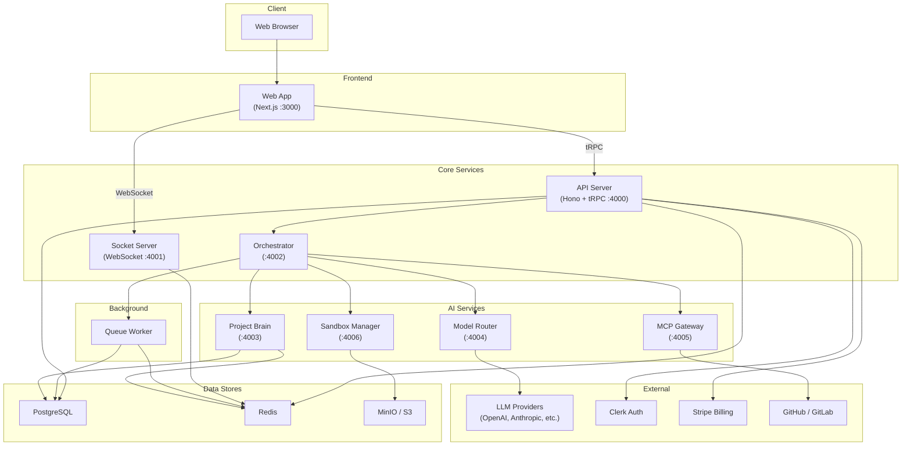
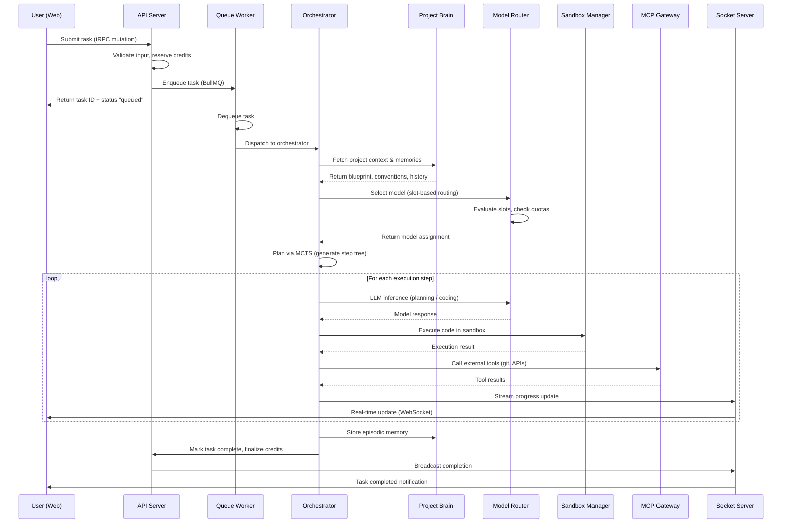
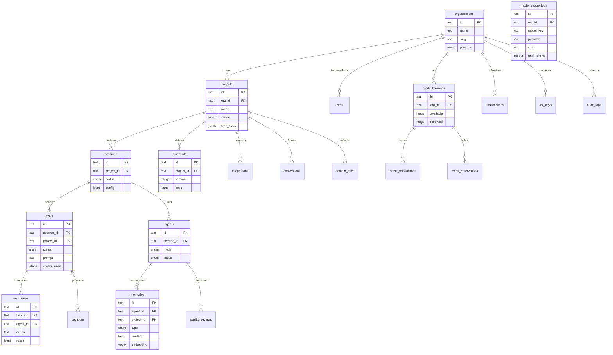

# Prometheus Architecture

## System Architecture

High-level view of all 9 services and their interconnections.

## Data Flow: Task Execution Lifecycle

End-to-end flow when a user submits a task through to completion.

## Database Schema Overview

Key tables and their relationships.

## Service Responsibilities

| Service | Purpose | Key Technologies |
|---------|---------|-----------------|
| **Web** | Next.js frontend with workspace UI | Next.js, React, tRPC client, Tailwind |
| **API** | Central REST/tRPC gateway | Hono, tRPC, Drizzle ORM, Zod |
| **Orchestrator** | Coordinates agent execution | Async generators, MCTS planner |
| **Socket Server** | Real-time bidirectional comms | WebSocket, Redis pub/sub |
| **Project Brain** | Knowledge graph and memory | Embeddings, vector search, RAG |
| **Model Router** | Slot-based LLM selection | Adaptive fallback, cost tracking |
| **MCP Gateway** | External tool integration | Model Context Protocol, GitHub API |
| **Sandbox Manager** | Isolated code execution | Container sandboxes, MinIO storage |
| **Queue Worker** | Background job processing | BullMQ, Redis-backed queues |
